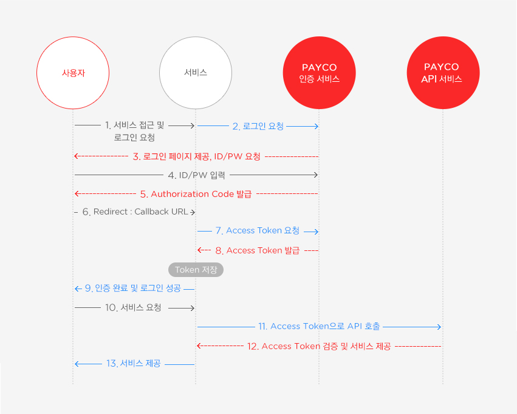

- OAuth 2.0
    - OAuth - Open Authorization. 인터넷 사용자들이 비밀번호를 제공하지 않고 다른 웹 사이트 상의 자신들의 정보에 대해 웹 사이트나 애플리케이션의 접근 권한을 부여할 수 있는 공통적인 수단으로서 사용되는 접근 위임을 위한 개방형 표준.
    - 신뢰할 수 있는 외부 어플리케이션의 Open API를 통해 해당 애플리케이션이 인증 과정을 처리해준다.
    - PAYCO API의 예시
    
    
    
    1. 사용자가 서비스에 로그인 요청.
    2. 서비스가 PAYCO에 인증 요청
    3. PAYCO가 유저에게 로그인 페이지 제공, Authorization Code 발급
    4. callback URL로 서비스에 Authoriation Code를 담아서 요청.
    5. Access Token 받아오고 저장
    6. 인증 완료후 서비스 요청. 이제 Access Token에 담겨있는 정보 서비스에서 사용 가능
- HTTP Cookie
    - 서버가 사용자의 웹 브라우저에 전송하는 작은 데이터 조각. 주로 세션 관리, 개인 설정유지, 사용자 트래킹 용도로 사용됨.
    - 한개에 4kb 저장 가능. 최대 300개까지 저장 가능한 텍스트 파일. 클라이언트에 저장되고 이름, 값, 만료날짜, 경로 정보가 들어있다. 웹브라우저가 종료되면 삭제되지만, 만료날짜가 존재하면 만료일이 되면 삭제되고, 웹 브라우저의 서버의 쿠키 정보가 있으면 자동으로 담아 보낸다.
    - 요청을 받은 서버가 쿠키를 클라이언트로 보내고 클라이언트는 도메인 서버 이름으로 정렬된 디렉토리에 쿠키를 저장한다. 이후에 동일한 도메인에 요청을 보내면 쿠키가 같이 전송된다.
    - HTTP session - 통신을 하기 위해 연결된 순간부터 통신을 마칠 때 까지의 기간. 세션 쿠키를 클라이언트에게 주어 서버가 클라이언트를 식별 할 수 있도록 하는 방식을 의미한다.
    - 쿠키에 session id가 없다면 서버에서 session id를 생성하고 응답을 보낼 때 쿠키에 담아서 보낸다. 클라이언트는 세션 쿠키를 저장해두고 해당 서버에 요청을 보낼 때마다 세션 쿠키를 함께 보내게 된다.