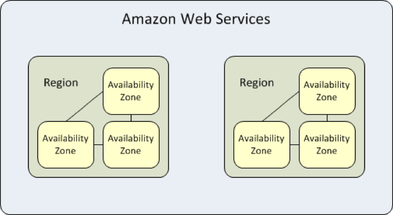
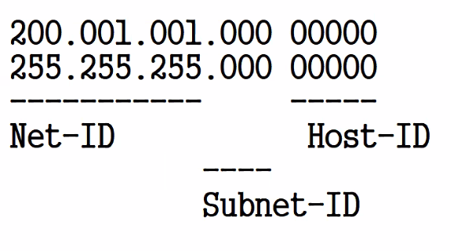

- AWS
    - Amazon Web Service - 아마존의 클라우드 컴퓨팅 서비스. 컴퓨팅, 스토리지, 데이터베이스와 같은 인프라 기술부터 기계 학습, 인공 지능, 사물 인터넷 등의 타 클라우드 서비스에서는 보기 힘든 것들도 있다.
    - 세계 점유율 1등. 25개의 리전과 81개의 가용 영역을 보유하고 있고 128개 이상의 엣지 로케이션을 보유하고 있다.
    - 탄력성 기반 종량과금제라서 사용하는 만큼 비용이 부과됨.
- 리전과 가용영역
    
    
    
    - 리전
        - 리소스를 호스팅할 수 있는 특정한 지리적 위치
        - AWS에서는 지리적 영역 내에서 격리되고 물리적으로 분리된 최소 3개의 가용영역으로 구성됨.
        - 여러 지역에 클라우드 서비스를 제공할 수 있도록 각 리전 내에 하나 이상의 물리적 데이터 센터가 있다.
        - 높은 대역폭의 전용 네트워크에 연결되어 있어, 해당 리전 내에서 호스팅되는 컴퓨팅 리소스와 서비스에 빠르게 액세스 가능.
        - 특정 리전에 서비스 생성 및 배포 가능
    - 가용 영역
        - AZ(Availability Zone). 각각의 클라우드 리전 내에서 물리적으로 격리된 컴퓨팅 리소스를 갖춘 독립적 위치.
        - 가용 영역은 100km 이내의 거리에 위치하며, 서로 물리적으로 격리되어 있다.
        - 동일한 지리적 위치에 하나 이상의 데이터 센터로 구성됨.
        - 해당 영역 내에 배치된 리소스 간에는 높은 처리량과 낮은 지연 시간 제공.
        - 사용하기 위해서는 인스턴스를 시작할때 리전과 VPC를 선한 후, 가용 영역 중 하나의 서브넷을 선택해야 함.
- 서브네팅
    - IP 주소를 효율적으로 사용하기 위해서 네트워크를 나누는 과정
    - 장점
        1. 효율성 - 낭비되는 IP 주소를 효율적으로 관리할 수 있고, 네트워크를 나누는 용도로도 할 수 있다.
        2. 데이터를 보낼 때 브로드캐스팅을 하게 되면 트래픽 저하가 생길 수도 있지만 서브네팅을 통해 트래픽을 감소 시킬 수 있다.
        3. 보안상으로 하나의 도메인에 모든 정보가 있다면 모든 정보가 유출될 수 있다. 서브네팅으로 네트워크를 나누면 보안적으로 이점이 있다.
    - 서브네팅 하는법
        
        
        
        - Host-ID로 사용하고 남은 부분은 Subnet-ID가 된다.
        - 따라서 총 8개의 서브넷을 구성할 수 있게되고, 하나의 서브넷에 2^5 = 32개의 IP주소를 할당할 수 있다.
        - 여기서 첫 IP 주소는 네트워크 이름, 마지막 주소는 브로드 캐스트 주소이므로 2개의 IP는 사용된다.
        - 결론적으로 서브넷 마스크는 111111111.11111111.11111111.11100000 = 255.255.255.224
- 라우팅
    - 데이터 패킷을 한 네트워크 상에서 다른 네트워크로 이동시키는 가장 효율적인 경로를 찾는 프로세스.
    - 라우터 - 네트워크에서 라우팅을 수행하는 네트워크 장치.  다른 네트워크와의 연결점 역할을 한다.
    - 라우팅 테이블 - 라우터에 내장된 데이터베이스. 네트워크 내의 경로를 저장한다.
        - 메트릭 - 라우팅 결정을 할 때 사용되는 값. 다음과 같은 요소가 있음.
            - 홉 카운트 : 패킷이 목적지에 도달하기 위해 거쳐야 하는 라우터 수
            - 대역폭 : 일정 시간동안 전송 가능한 데이터의 최대 용량
            - 지연 시간 :  패킷이 출발지에서 목적지까지 도달하는 데 걸리는 시간
            - 신뢰성 : 링크의 오류율이나 다운타임과 같은 요소를 고려하여 산출된 값
            - 부하 : 네트워크 연결의 현재 트래픽 양
            - 비용 : 네트워크 연결에 할당된 비용 값
    - 라우팅 유형
        - 고정 라우팅 : 관리자가 수동으로 라우팅 테이블을 설정하는 방식.
        - 설정이 간단하고 안정적이지만, 유연한 대처가 안되고 최적의 경로가 아닐 수 있다.
        - 동적 라우팅 : 네트워크 상황에 따라 조정되는 방식
        - 확장성이 좋고 유연하지만, 비용이 들고 보안 수준이 낮다
    - 라우팅 프로토콜 - 라우터 간 통신 방식과 경로를 결정하는 통신 규약
        - RIP - 최저 홉 카운트로 전달. 30초마다 라우팅 정보 브로드캐스팅.
        - OSPF- 라우터에서 패킷을 목적지로 보내는 최단 경로 계산
        - EIRGP - 다양한 메트릭을 활용해 최적의 경로 결정.
        - BGP - 자율시스템 간의 라우팅 정보 교환
- VPC
    - Virtual Private Cloud - 클라우드 환경을 펴블릭과 프라이빗의 논리적으로 독립된 네트워크 영역으로 분리할 수 있게 해준다.
    - VPC 내에서 퍼블릭 서브넷과 프라이빗 서브넷을 생성할 수 있다. Direct Connect로 기업 데이터 센터와 전용 회선으로 연결할 수도 있고, VPC 피어링으로 다른 VPC와도 연결할 수 있다.
    - VPC 구성 요소
        - 서브넷
            - AWS에서 서브넷 IP 대역에서 총 5개의 IP 주소는 예약되어 있음
                - 첫번째 : 네트워크 주소
                - 두번째 : AWS VPC 가상 라우터 주소
                - 세번째 : AWS DNS 서버 주소
                - 네번째 : 향후 새로운 기능에 활용할 주소
                - 마지막 : 네트워크 브로드캐스트 주소
        - 가상 라우터, 라우트 테이블
        - Internet Gateway
        - Nat Gateway
        - NACL, Security Group
- 사설 IP 주소
    - 특정 네트워크 안에서만 내부적으로 사용되는 고유한 주소. 로컬 IP라고도 불린다.
    - 공인 IP는 전 세계에서 유일하지만, 사설 IP는 하나의 네트워크 안에서 유일하다.
    - 사설 IP는 내부에서만 접근 가능.
- 포트포워딩
    - 네트워크에서 라우터를 거쳐 하나의 IP주소와 포트번호의 결합으로 통신요청을 다른 곳으로 넘겨주는 역할.
    - 12.34.56.78 이라는 라우터 IP에 192.168.0.1이라는 사설 IP가 연결되어 있을때, 12.34.56.78:8000이라는 주소로 사설 PC에 연결하려면 포트포워딩으로 192.168.0.1:3000으로 요청이 가도록 해야 한다.
- NAT 프로토콜
    - Network Address Translation - 인터넷 주소 번역 기능.
    - 공유기(라우터)에 연결되어있는 각 사설 IP를 받아와 유일한 공인 IP로 변환하고, 외부 인터넷으로 공인 IP 주소를 내보낸다.
- 포트 번호
    - 포트번호는 TCP/IP 네트워크에서 특정 프로세스나 서비스를 식별하기 위해 사용되는 숫자
    - 특징
        - 16비트로 이루어져 있다. 따라서 0~65525번까지 존재한다.
        - 0 ~ 1023번 : Well Known Ports. 표준화된 서비스에 할당된다.
        - 1024~49151 : Registered Ports. 특정 어플리케이션이나 프로세스에 예약된다. (기관이나 사업자들을 위해 IANA에서 관리)
        - 49152~65535 : Dynamic / Private Ports. 일시적인 연결에 사용되거나, 동적으로 할당될 수 있다.(일반 사용자)