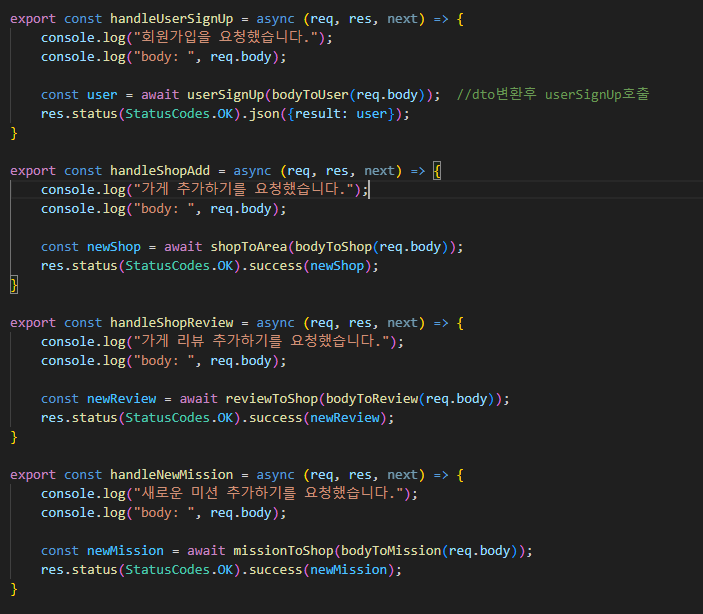

- **미션 기록**
    
    
    
    API 응답 통일 해주기. 응답이 성공적이면 res.success 실행.
    
    
    
    에러 처리 미들웨어. 에러가 발생하면 실행됨.
    
    
    
    응답 통일을 위해 res.status().success()로 응답보내기
    
    
    
    에러 특정화를 위한 개별의 에러 객체 생성 과정.
    
    
    
    에러 객체의 정의. Error 객체를 물려받고 errorCode를 부여해준다.
    
    실행 예)
    
    - 상점의 리뷰 불러오기 API의 응답 통일
    
    
    
    이제 resultType, error유무, 결과 data가 반환되어 실행 결과를 더 직관적으로 알 수 있다.
    
    - 에러 통일화
    
    1.상점에 리뷰 추가
    
    
    
    상점을 찾을 수 없을 때 나오는 에러이다.
    
    2.미션 수락하기
    
    
    
    미션 수락하기에서 미션이 이미 수락되었을 때 출력되는 에러이다. 더 직관적으로 에러를 식별할 수 있게 된다.
    
    3. 상점에서 리뷰 불러오기
    
    
    
    레포지토리에서 리뷰 불러오기를 위해 상점을 찾았을 때 상점이 없으면 null을 반환하고, 상점은 찾았지만 리뷰가 없을때는 리턴된 객체의 길이가 0이라는 걸 이용해 에러 처리
    
    
    
    
    
    4.미션 완료 처리하기
    
    
    
    레포지토리에서 처리한 mission 데이터가 없다면 에러 처리
    
    