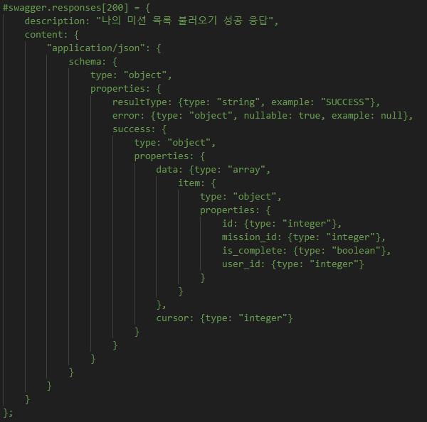
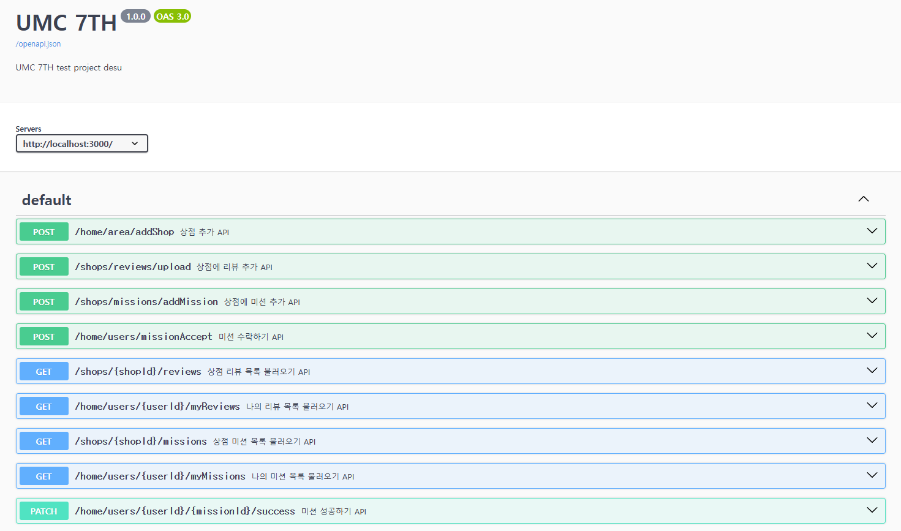
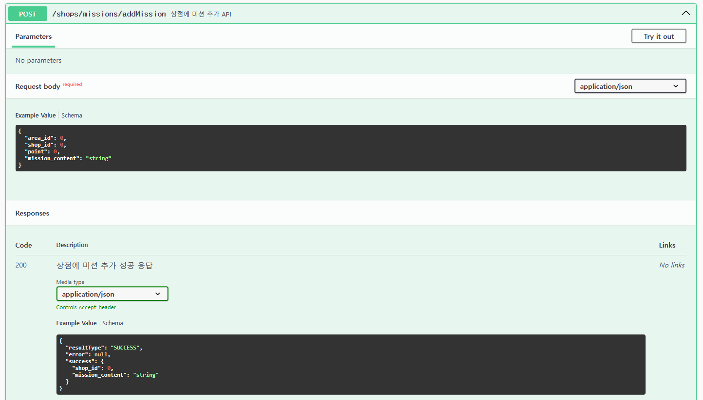
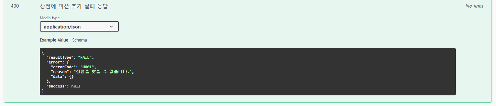
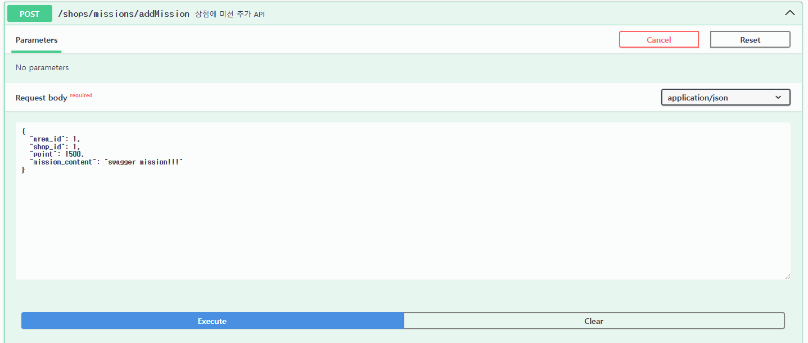
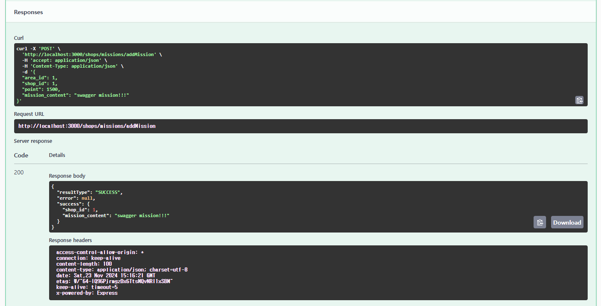

- **미션 기록**
    
    # Swagger 주석
    
    - Swagger 주석으로 만들기
        
        
        
    - 에러처리를 해야 하는 경우 (status code가 다를 때)
        
        
        
        
        
    - 목록형 자료형을 받아올 때 (type: array, item: object)
        
        
        
    
    # 실행 결과
    
    - 실제 swagger 페이지 모습
    
    
    
    - API 상세 모습
    
    
    
    
    
    - swagger에서 API 테스트 해보기
    
    
    
    