- **미션 기록**
    - 구글 로그인 기능 구현하기 - googleStrategy
        
        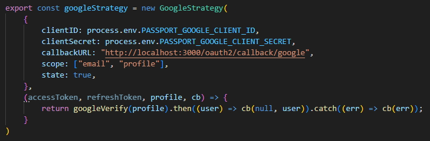
        
        auth.config.js
        
    - googleVerify - 회원 있는지 확인 후 없으면 회원 가입 시킴
        
        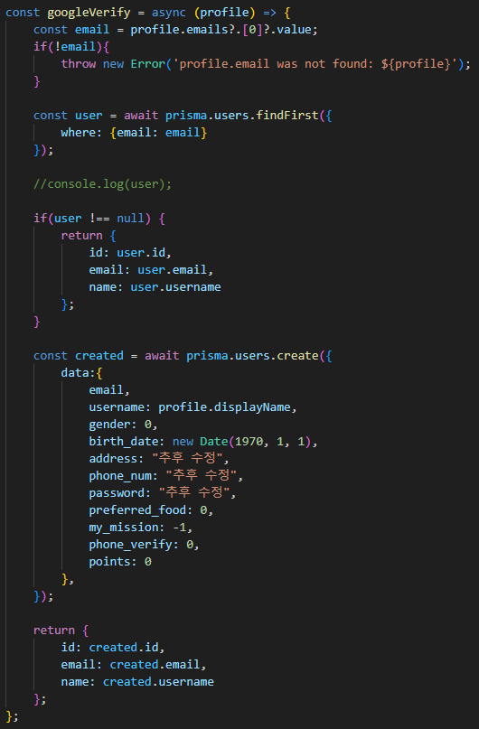
        
        auth.config.js
        
    - index.js 패스포트 세팅
        
        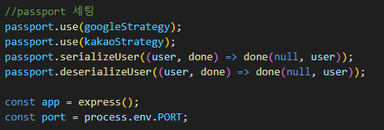
        
        index.js
        
    - express 세션 설정
        
        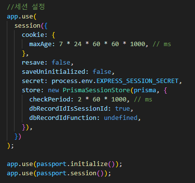
        
        index.js
        
    - 구글 로그인 페이지
        
        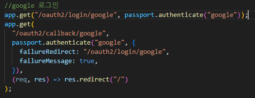
        
        index.js
        
    - 카카오 로그인 구현 - kakaoStrategy
        
        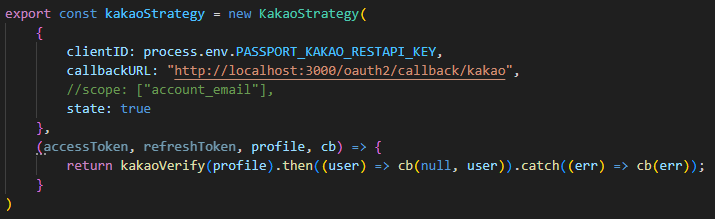
        
        auth.config.js - 거의 모든 사용자 프로필 정보가 막혀있음. 사업자 번호가 없으므로 이메일만 카카오에서 풀어놓았고 별도의 scope 지정은 하지 않음
        
    - kakaoVerify
        
        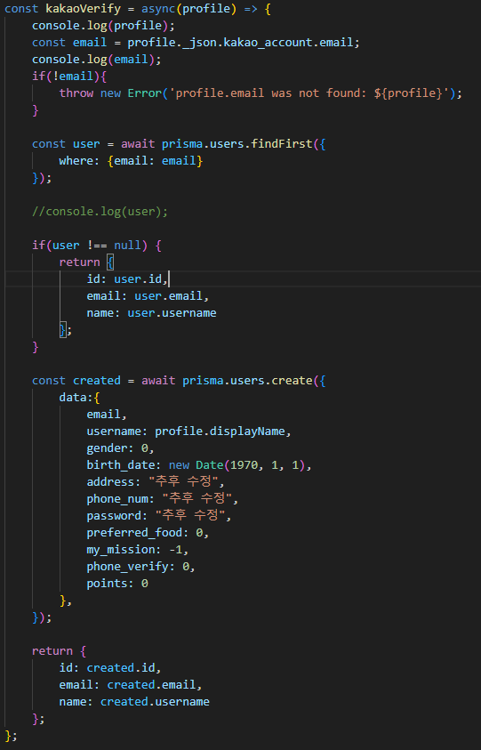
        
        auth.config.js - 구글과 동일하게 작동
        
    - 카카오 로그인 페이지
        
        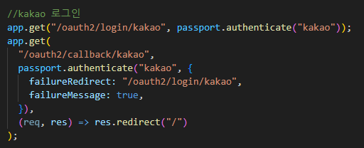
        
        index.js
        
    - 카카오 로그인 실행 결과
        
        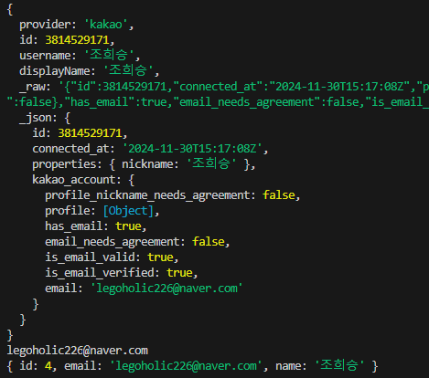
        
        잘된다
        
        
        
        4번 레코드에 가입 완료
        
    - 유저 정보 수정 API
        
        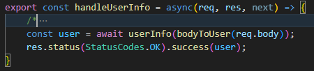
        
        user.controller.js
        
        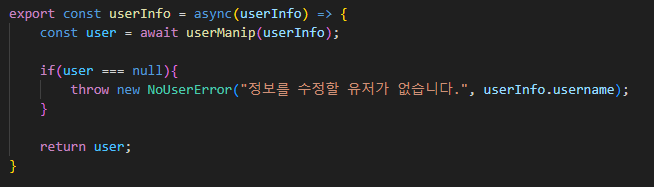
        
        user.service.js
        
        
        
        user.repository.js
        
    - 실행 결과
        
        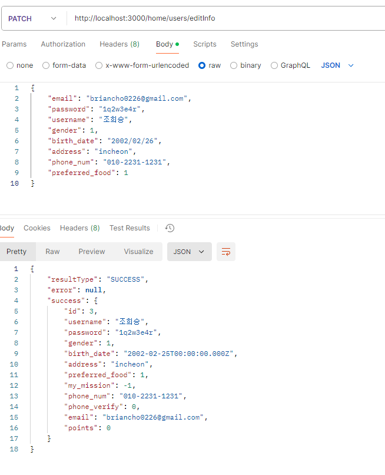
        
        잘된다