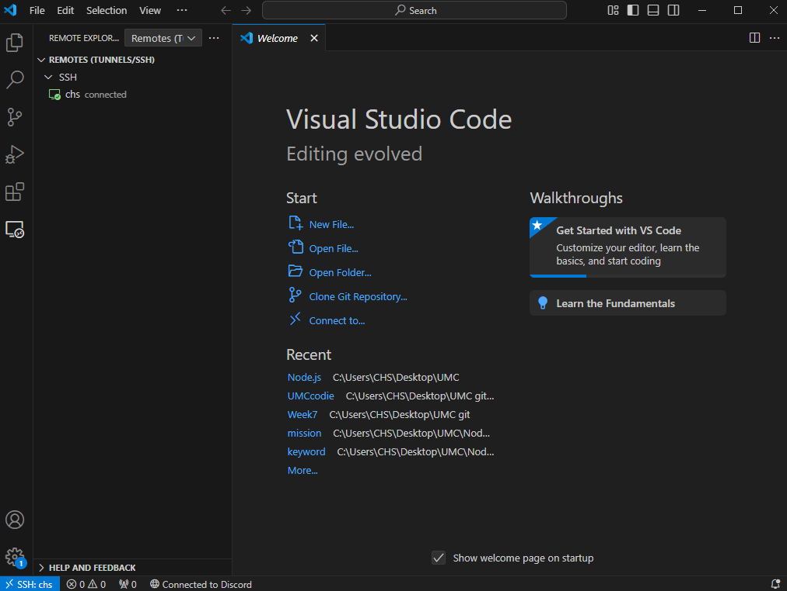
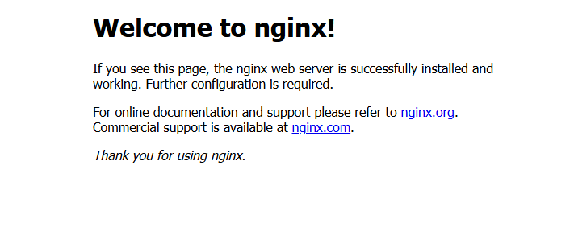

- **미션 기록**
    - VPC
        
        
        
    - 서브넷
        
        
        
    - 게이트웨이
        
        
        
    - 라우팅 테이블
        
        
        
        
        
    - security group
        
        
        
    - 탄력적 ip
        
        
        
    - ec2
        
        
        
    - 원격 호스팅 연결
        
        
        
    - nginx
        
        